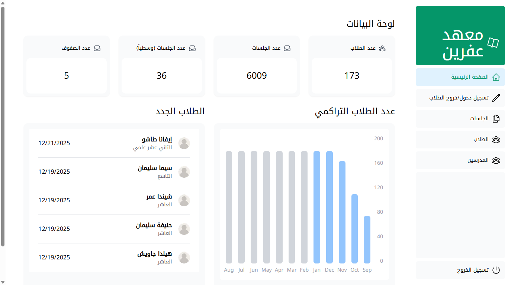
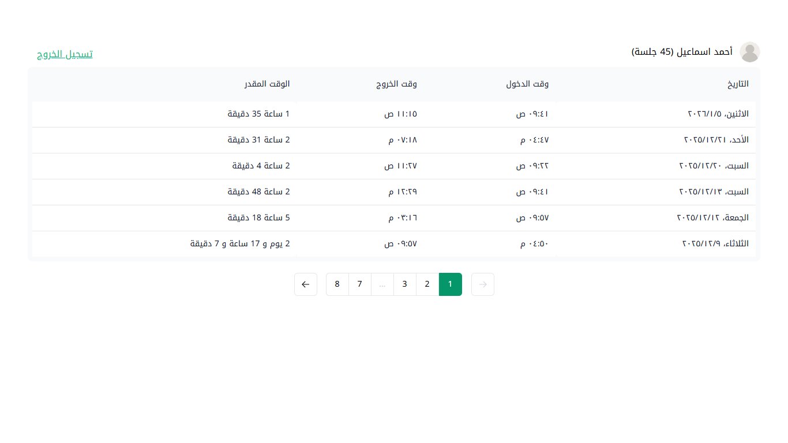
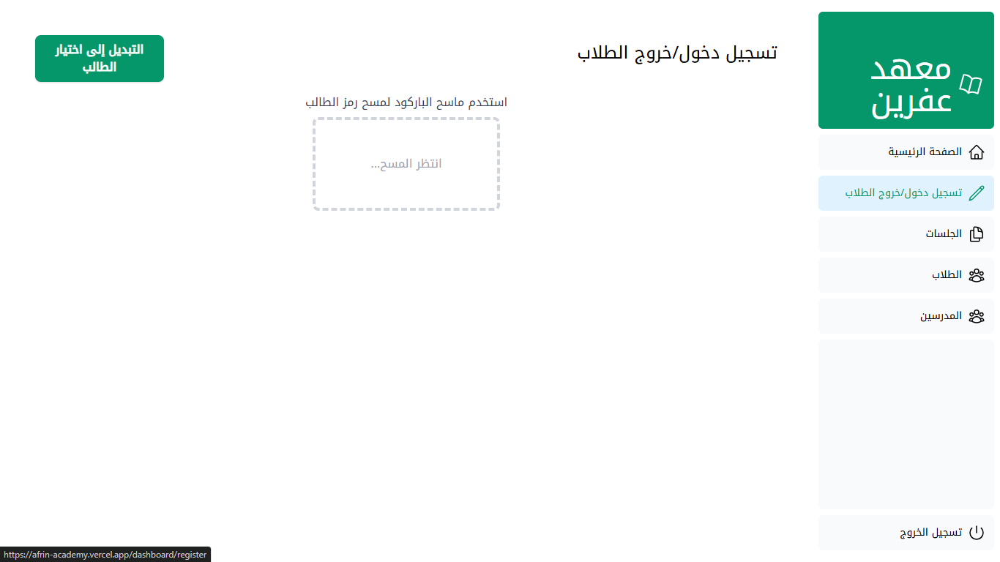
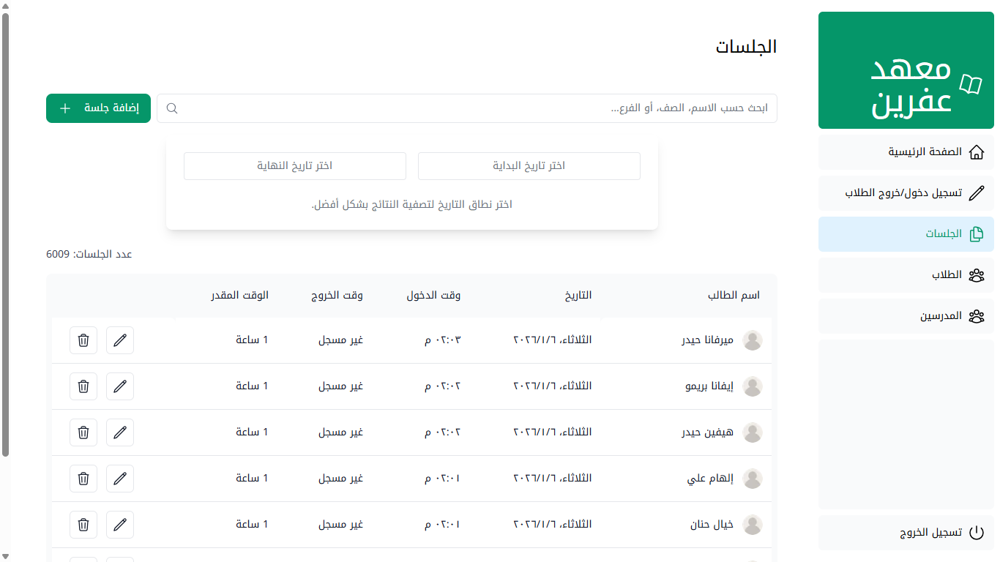
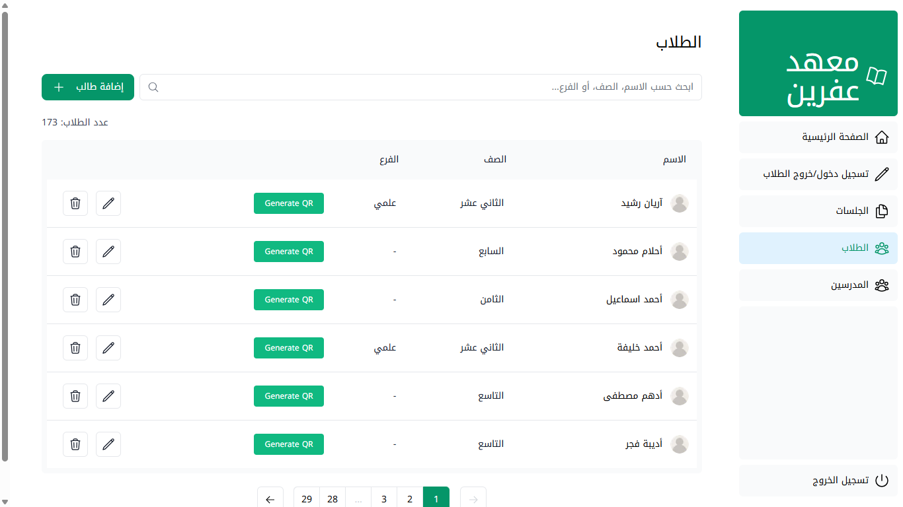
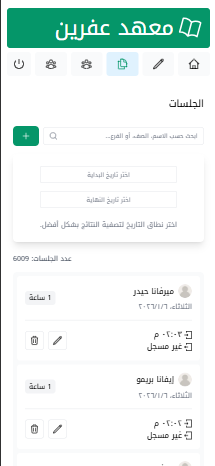
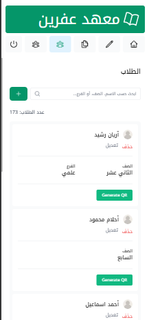
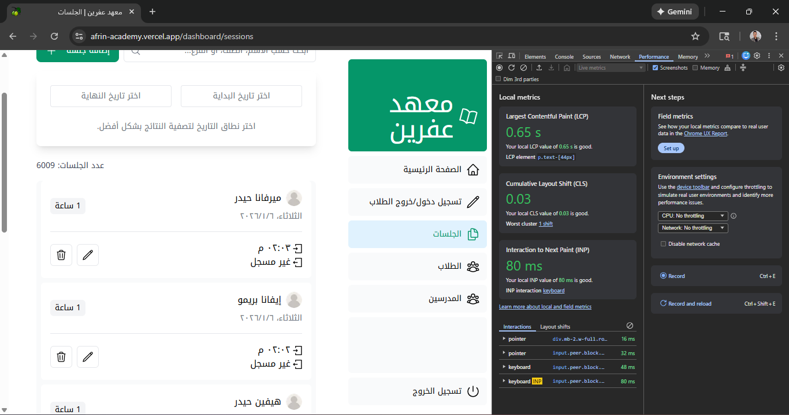
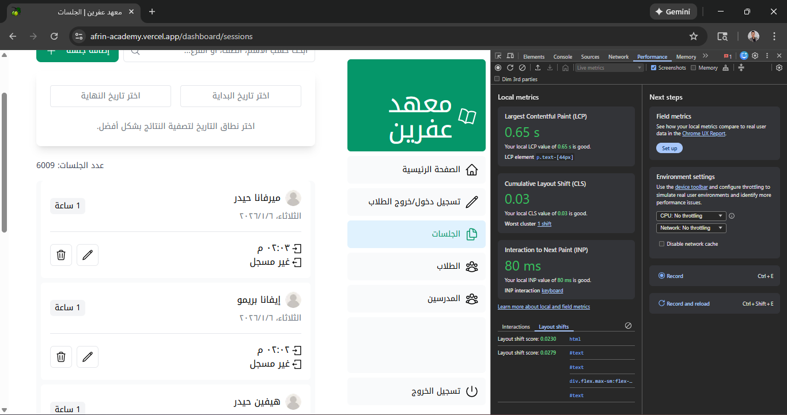
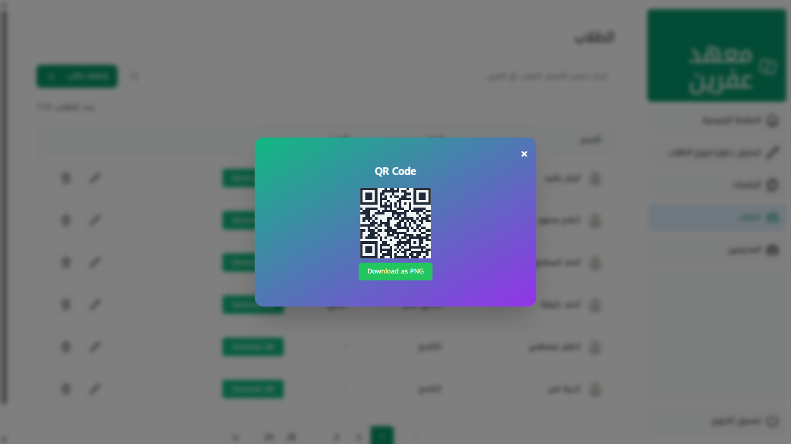

# Afrin Academy Platform

## 🌐 Live Demo

## 🔗 Social Links

  

  

  

## Overview

Afrin Academy is a modern web platform designed to streamline communication between academy administration and students' parents. It provides real-time access to attendance records, student management, and administrative insights through a secure and user-friendly interface.

<!-- ========================================= -->

<!-- ========================================= -->

## 🚀 Features

### 🎓 Student Access
- Each student receives a unique card with a **QR code**.
- QR code enables secure login to the student dashboard.
- Students can view detailed attendance reports including:
  - Full date and day of attendance.
  - Check-in and check-out times.
  - Total time spent at the academy.
- Data is displayed in a **sleek, paginated table** for enhanced user experience.

---

## 🛠️ Admin Dashboard

Admins access the platform using their own unique QR-coded cards. The dashboard includes:

### 🏠 Home Page
- Total number of registered students.
- Total number of sessions attended.
- Number of classes (Grade 7–12).
- Average sessions per day.
- A chart showing student growth over the year.
- The five most recently registered students.

### 🔄 Check-In/Check-Out Page
Three methods for registering attendance:
1. **Barcode reader**
2. **Manual input** via dropdown (with date selection)
3. **QR code scanning** using the device camera

Includes conflict detection and clear feedback for check-in/out errors.

### 📅 Sessions Page
- Full CRUD operations on student sessions.
- Filtering by date, student name, class, and department.

### 👨‍🎓 Students Page
- Full CRUD operations on student profiles.
- Add new students and generate unique QR codes instantly.

---

## 📱 Other Features
- Fully **mobile-friendly** responsive design.
- Authentication via QR codes using **NextAuth**.
- Optimized images, links, and fonts thanks to **Next.js**.
- Search, pagination, and URL search parameters.
- Form validation and accessibility using **Zod**.
- Metadata and OpenGraph support.
- Smooth navigation with automatic code-splitting and prefetching (Next.js App Router).
- Instant data fetching via **server actions** directly querying PostgreSQL.
- Static + dynamic rendering with streaming for fast page loads and strong SEO.

---

## 🧰 Tech Stack

      

---

## 📈 Performance Highlights
- Fast page loads with **streaming** and **SSR**.
- Minimal JavaScript overhead for searching, sorting, and filtering.
- Clean UI with intuitive navigation and real-time feedback.

---

## 🏫 Purpose
Afrin Academy empowers educational institutions to manage student attendance and engagement efficiently, while keeping parents informed and involved.

---

## 🔒 Security & Scalability
- Unique **QR-based authentication**.
- Scalable architecture with optimized database queries.
- Future-proof design with modular components and reusable logic.

---

## 📦 Versions

## 🏗️ Built With

